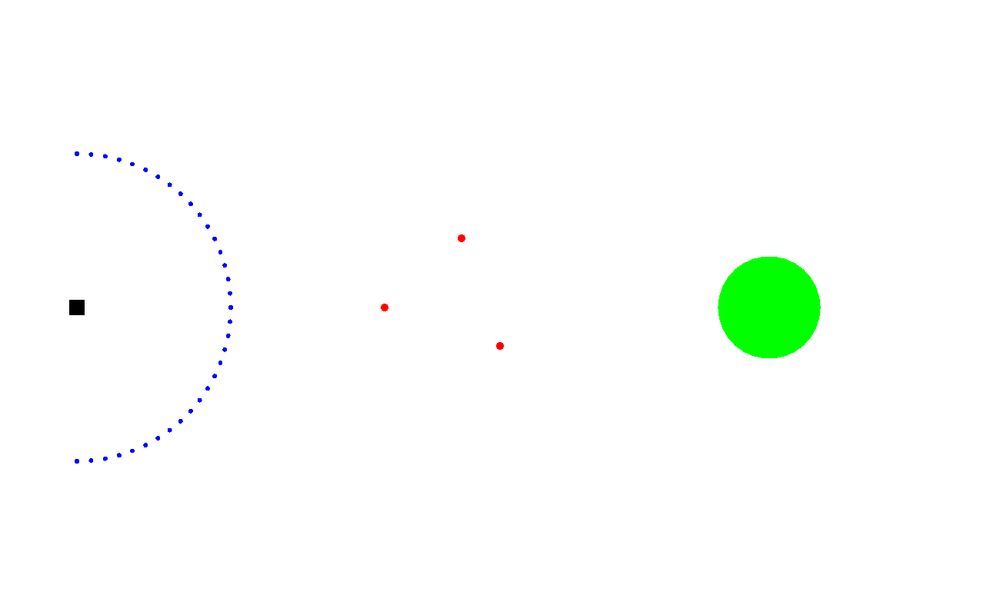

# Project Title

Transfer Learning for Mapless Quadrotor Navigation Using Recurrent Neural Network

## Abstract

We propose two deep recurrent neural network architectures (reinforcement learning and supervised learning) to solve quadrotor obstacle avoidance and navigation problems.  First, trainingthese neural networks only in simulation environment, they are able to directly transfer into realworld without any fine-tuning.  Both models achieve navigation tasks with success rate over 90%.  Second, we show the generalization ability of these models.  Training on few simple environments and transferring directly into unseen complex environments, both models perform navigation success rate up to 90%.

## Getting Started

There are two parts for this project
* Training Reinforcement learning navigation model in OpenAI Gym environment 
* Training Supervised learning navigation model by state-action pairs collecting from turtlebot_flatland environment

## Prerequisites

* [flatland](https://github.com/avidbots/flatland) - Ros depository for map and robot setup for 2D flatland navigation environment
* [turtlebot_flatland](https://github.com/avidbots/turtlebot_flatland) - Turtlebot navigation demo under flatland
* [OpenAI/Gym](https://github.com/openai/gym) - A toolkit for developing and comparing reinforcement learning algorithms
* [sweep-ros](https://github.com/scanse/sweep-ros) - LIDAR sensor ROS driver
* [bebop-autonomy](https://github.com/AutonomyLab/bebop_autonomy) - ROS driver for Parrot Bebop drone (quadrocopter)
* [vicon_bridge](https://github.com/ethz-asl/vicon_bridge) - A driver providing data from VICON motion capture systems
* [joystick_drivers](https://github.com/ros-drivers/joystick_drivers) - ROS joystick driver
* [bebop_vicon_ctrl](https://github.com/mdeyo/bebop_vicon_control) - Ros setup for control bebop in vicon envionemnt


## Repositories
* [globalplan_record](globalplan_record): Code for record the navigation actions from ros-navigation planner
* lidar: Connection and plotting LIDAR distance readings
* [envs](envs): Environments for training reinforcement learning navigation model under [OpenAI/Gym](https://github.com/openai/gym)

## Map naming

### [Map for turtleble_flatland](turtlebot_flatland/maps)
```
turtlebot_flatland/maps
```

* Cyliner_map -> cylinder_map1.png 
* Rectangle_map -> rectangle_map1.png 
* Wall_map -> wall_map1.png 
* Office_map -> complex_map3.png 
* Street_map -> complex_map5_2.png 
* Forest_map -> complex_map6.png

### [Map for OpenAI Gym](envs/curriculum/envs)
```
envs/curriculum/envs
```

* Cyliner_map -> planner_cylinder_map4.py
* Rectangle_map -> planner_rectangle_map1.py
* Wall_map -> planner_wall_map1.py
* Cylinder_map + Rectangle_map -> planner_cylinder4_rectangle1.py
* Cylinder_map + Wall_map -> planner_cylinder4_wall1.py
* Rectangle_map + Wall_map -> planner_rectangle1_wall1.py
* Cylinder_map + Rectangle_map + Wall_map -> planner_cylinder4_rectangle1_wall1.py
* Office_map -> planner_complex_map4.py
* Street_map -> planner_complex_map5_1.py
* Forest_map -> planner_complex_map6.py

## Result

### 1D navigation - simulation



### 1D navigation - real world


### 2D navigation - simulation


## Acknowledgments 

* Stefan Stevsic, ETH Zürich
* Prof. Dr. Otmar Hilliges, ETH Zürich
* Prof. Dr. Moritz Diehl, University of Freiburg
